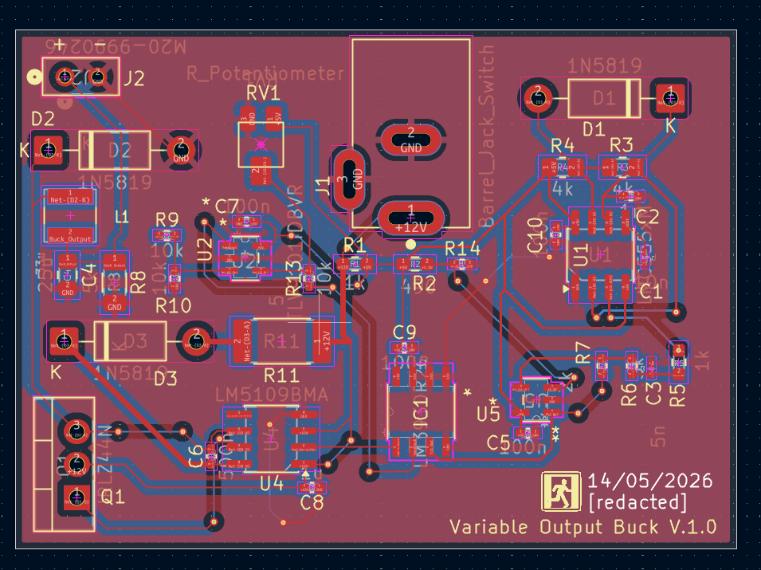
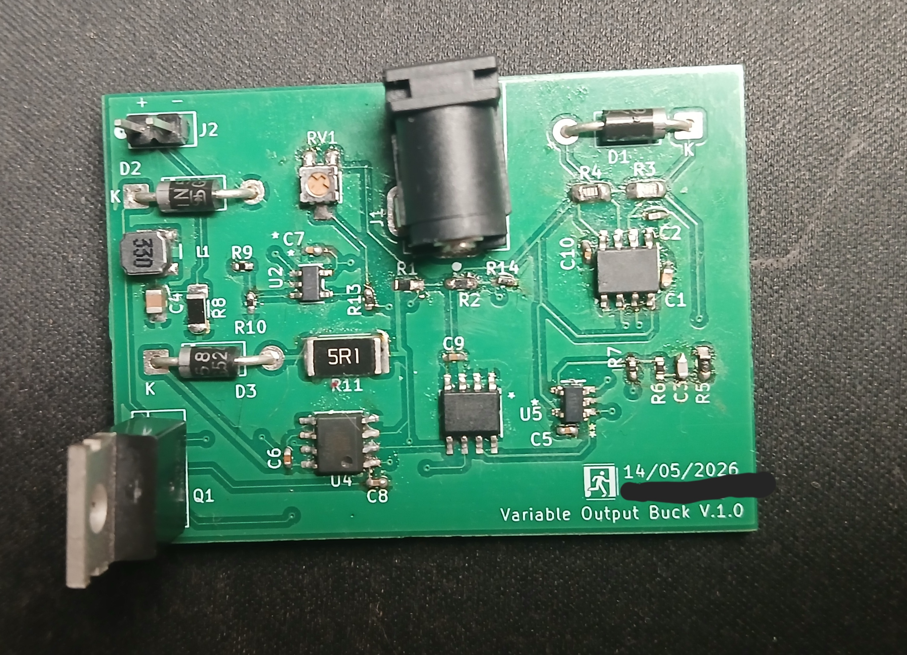

## [Variable Buck Converter(WIP)](./Buck/)

This project involved creating a buck converter which could regulate a 10V power supply to voltage suitable for a breadboard. simulations were done in LTspice and KiCad was used for creating schematics and PCB Layout.

### PCB Revision #1

Currently awaiting second revision, due to high currents causing gate driver IC to fry

